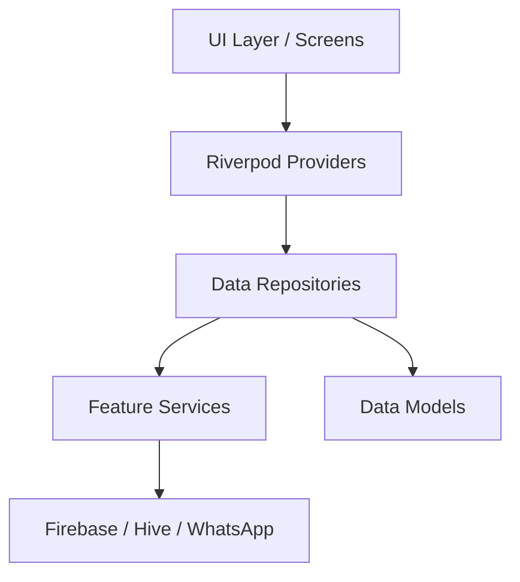

# 🪄 Viyan Billing - Premium Retail Management

Viyan Billing is a high-performance, modern billing and inventory management application designed for shops that demand speed, elegance, and professional features. Built with a focus on **User Experience** and **Professionalism**, it transforms traditional billing into a magical experience.

---

## ✨ Key Features

### 🛒 Seamless Billing
- **Voice-Powered Billing**: Simply speak to add items to the cart using advanced Speech-to-Text integration.
- **Smart Search**: Find any item instantly with fuzzy search and category filtering.
- **Active Tokens**: Manage multiple customers simultaneously with an elegant token-based system.

### 📱 Professional Communication
- **WhatsApp Integration**: Send personalized, professionally formatted bills directly to customers.
- **Dynamic Templates**: Greeting customers by name with premium formatting (bolding, emojis).
- **PDF Generation**: Generate beautiful, print-ready PDF invoices locally on the device.

### 📊 Business Intelligence
- **Interactive Reports**: Track daily, weekly, and monthly sales with sleek charts.
- **Profit Analysis**: Automatic margin and profit calculation for every item.
- **Customer History**: Deep insights into customer purchasing patterns.

### 🛡️ Core Reliability
- **Offline-First**: Keep billing even without internet. Data syncs to the cloud automatically when back online.
- **Cloud Backup**: Securely sync your shop data, items, and orders with Firebase.
- **Multi-Store Ready**: Support for shop branding, UPI details, and custom logos.

---

## 🏗️ Architecture

The project follows a **Feature-Driven Clean Architecture** to ensure long-term scalability and maintainability.



- **Features**: Grouped by functionality (Auth, Billing, Items, Shop Setup).
- **Data Layer**: Clean abstraction using the Repository pattern.
- **State Management**: Robust and reactive state handling via Riverpod.

---

## 🛠️ Technology Stack

- **Framework**: [Flutter](https://flutter.dev) (Modern UI & High Performance)
- **State Management**: [Riverpod](https://riverpod.dev) (Type-safe & Scalable)
- **Database (Local)**: [Hive](https://pub.dev/packages/hive) (Ultra-fast NoSQL)
- **Database (Cloud)**: [Firebase Firestore](https://firebase.google.com) (Real-time Sync)
- **Storage**: [Firebase Storage](https://firebase.google.com) (Image & Asset hosting)
- **PDF Engine**: [Pdf & Printing](https://pub.dev/packages/pdf)
- **Communication**: [Url Launcher](https://pub.dev/packages/url_launcher) & [Share Plus](https://pub.dev/packages/share_plus)

---

## 🚀 Getting Started

### Prerequisites
- Flutter SDK (Latest Stable)
- Android Studio / VS Code
- A Firebase project setup

### Installation
1. Clone the repository:
   ```bash
   git clone https://github.com/Shanmugavelarumugam/viyan-billing.git
   ```
2. Install dependencies:
   ```bash
   flutter pub get
   ```
3. Run the application:
   ```bash
   flutter run
   ```

---

## 📱 Screenshots

| Billing Screen | Checkout & WhatsApp |
|:---:|:---:|
| 🪄 *Voice billing & Token management* | 💰 *Professional Invoice formatting* |

---

## 🤝 Support
For any questions or support, please contact the development team at **ashanmugavel821@gmail.com**.

*Built with ❤️ for Chidambaram Sweets.*
